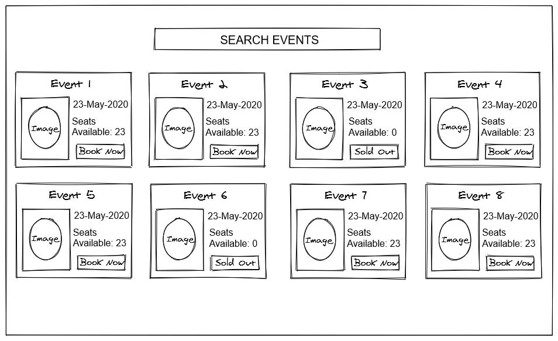
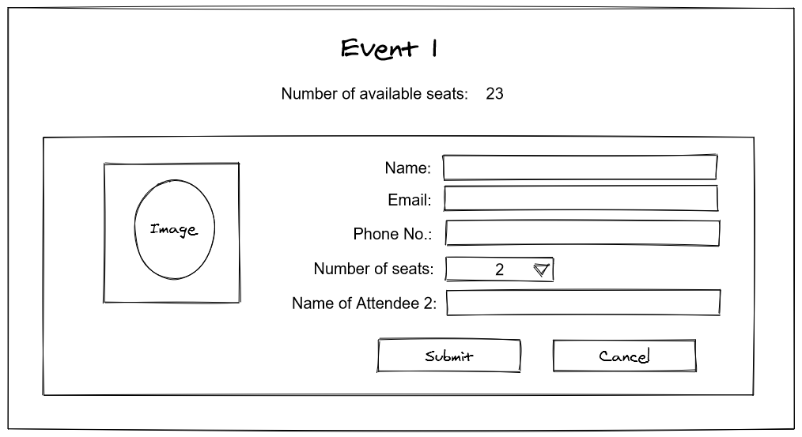

# Axelerant: Senior Front-end Developer Interview

### Background

This exercise is to test your front-end skills. You have to take the following requirements and convert them to an Event booking application.

### Requirements: Event booking application

#### Application details

- Create an application that lists events and the ability to book tickets for that event.
- The application has 2 pages - event listing and event booking.
- The application should be mobile responsive.

#### Event Listing

- There is a search input on the top of the listing with placeholder - “SEARCH EVENTS”.
- The events are listed in a grid of 4 columns (single column in mobile view).
- Each event block has a name, image, date of the event, the number of seats available for the event and "Book Now" button.
- The events data is fetched from a JSON file through an HTTP request. This could be a local JSON file.
- Events start filtering as soon as the user starts entering letters in the Search input.
- The search is done only on the name of the event, on all the events(independent of the availability of the seats)
- If the search doesn't produce results, "No results found!" is displayed in the listing area.
- In the event block, if seats are available, "Book Now" button is shown. On clicking the "Book Now" button of an event, the user is redirected to the Event booking page.
- If the seats are not available for the event, there should be no "Book Now" button on the event block. In place of "Book Now" button, "Sold Out" text is shown.

#### Event Booking

- The header of the page should be the name of the event.
- Below the header, the number of available seats is displayed with the label - "Number of available seats".
- Below is the booking form that includes the following fields:
  |Field |Field Label |Validation |Validation Message |
  |----------------------------------------------------------------------------------------------------------------------|--------------------------------------|----------------------------------------------------------------|-------------------------------------------------------------------------------------------|
  |User Name (Text input) |Name |1. Required  2. Only Letters and spaces |1. “Please enter your name”  2. “Only letters and spaces are allowed” |
  |Email (Text input) |Email |1. Required Should be in email format |1. “Please enter your email”  2. “Invalid email” |
  |Number of seats (Dropdown from 1 to 6) |No. of Seats |1. Required  2. Number of seats selected greater than available seats |1. “Please enter the number of seats”  2. “Number of seats selected is more than available seats”|
  |Name of other attendees (Text input depending on number of seats selected. Not required if the number of seats is 1)|Name of Attendee #2  Name of Attendee #3|Required |1. “Please enter the name of Attendee #2”  2. “Please enter the name of Attendee #3”, ... |
- There are two buttons - Submit and Cancel, below the fields.
- If the Cancel button is clicked, the user is taken back to the listing page.
- If the Submit button is clicked, the following processes should take place:
  - If any validation fails, the validation message as given in the table is shown below each field where there is a validation error.
  - If all names are not provided for the selected number of seats, an error should appear below each name field which is not provided.
    - If there is no error, the form is successfully submitted and a message is shown below the header - "Tickets booked". Disable Submit and Cancel buttons.
    - Data is logged to the page and console

### How to start

- Login to [Codesandbox](https://codesandbox.io) using the `Sign in with GitHub` button on the top right corner.
- Click on this button to open the sandbox  
  
- You can start working on the implementation as per the requirements

### Brownie Points for:

- State management
- Building reusable components
- Showcasing the use of CSS Grids and Flex
- Addressing a11y issues
- Keeping things performant

### Submission

- After you are done with the exercise share the link to your sandbox to us.
